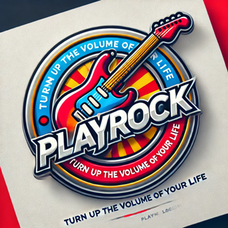

# playrock

Este repositorio contiene todos los artfactos vinculados con el oproyecto PlayRock, descrito dentro del artículo "Aprendizaje activo de Bases de Datos orientado a competencias en Ingeniería Informática", actualmente en revisión en las XXXI Jornadas sobre la Enseñanza Universitaria de la Informática (JENUI 2025).

- El directorio *pliegos* contiene las tres versiones del **pliego** del proyecto que sirvieron para describir el alcance de cada uno de sus spris.
- El directorio *cuadernos* contiene las tres versiones del **cuaderno de trabajo** que se le entregó a los estudiantes para que planificasen y gestionasen su trabajo en cada uno de los sprints.
- El directorio *valoración* contiene el formulario base para el **informe de valoración**.
- El tablero Scrum utilizado para proporcionar la **guía de trabajo**, con la descripción de las tareas sugeridas en cada sprint, está localizado en este [enlace](https://trello.com/b/7GYXAIzE/), aunque actualmente el acceso no está permitido para preservar el anonimato de los autores durante el proceso de evaluación del artículo.
