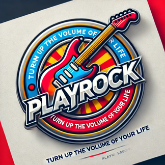

# playrock

Este repositorio contiene todos los artefactos vinculados con el proyecto PlayRock, descrito parcialmente en el artículo "Aprendizaje activo de Bases de Datos orientado a competencias en Ingeniería Informática" ([Actas de las Jenui, vol. 10. 2025](https://aenui.org/actas/fichas/JENUI_2025_011.html)):

- El directorio *pliegos* contiene las tres versiones del **pliego** del proyecto que sirvieron para describir el alcance de cada uno de los sprints de la primera parte del proyecto (asignatura Sistemas de Bases de Datos) y las tres versiones correspondoentes a la segunda parte del proyecto (asignatura Ampliación de Bases de Datos). 
- El directorio *cuadernos* contiene las tres versiones del **cuaderno de trabajo** que se le entregó a los estudiantes para que planificasen y gestionasen su trabajo en cada uno de los sprints.
- El directorio *valoración* contiene el formulario base para el **informe de valoración**.
- El tablero Scrum utilizado para proporcionar la **guía de trabajo**, con la descripción de las tareas sugeridas en cada sprint de la primera parte del proyecto, está disponible en este [enlace](https://trello.com/b/7GYXAIzE/).
